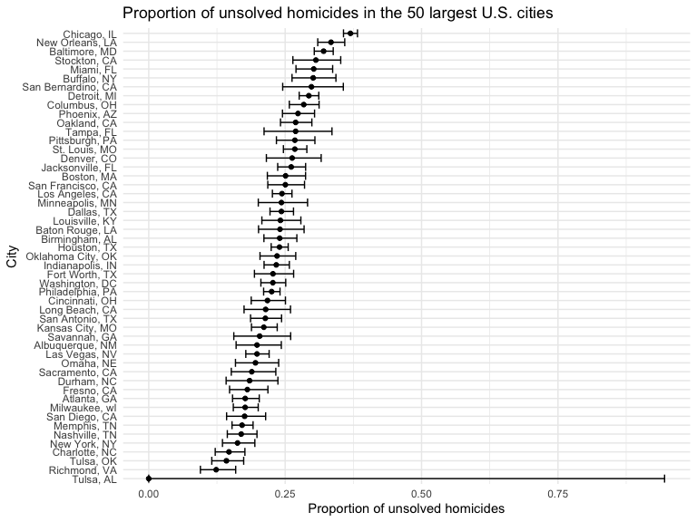

Homework 5
================
Juan Cambeiro
2022-11-16

## Problem 2

First, I will import and clean the homicide data that was gathered by
The Washington Post and describe the raw data.

``` r
homicide =
  read_csv("data/homicide-data.csv") %>%
  janitor::clean_names()
```

    ## Rows: 52179 Columns: 12
    ## ── Column specification ────────────────────────────────────────────────────────
    ## Delimiter: ","
    ## chr (9): uid, victim_last, victim_first, victim_race, victim_age, victim_sex...
    ## dbl (3): reported_date, lat, lon
    ## 
    ## ℹ Use `spec()` to retrieve the full column specification for this data.
    ## ℹ Specify the column types or set `show_col_types = FALSE` to quiet this message.

**Description of raw data**: This homicides dataset collected by The
Washington Post includes data on 52179 in 50 of the largest American
cities. The dataset contains 12 variables, including: the report date of
the homicide (`report_date`), the victim’s first and last name
(`victim_first`, `victim_last`), key demographics of the victim
(`victim_race`, `victim_age`, `victim_sex`), the location (`city`,
`state`, `lat`, `lon`), and the status of the case (`disposition`).

Next, I will tidy the data by using `mutate` to ensure appropriate data
types and to make a `city_state` variable.

``` r
homicide_tidy = homicide %>%
  mutate(city_state = as.factor(str_c(city, state, sep = ", ")), 
         reported_date = as.Date(as.character(reported_date),"%Y%m%d"), 
         victim_age = as.numeric(victim_age), 
         victim_sex = as.factor(victim_sex),
         victim_race = as.factor(victim_race), 
         city = as.factor(city),
         state = as.factor(state)) 
```

Now, I will use `group by` and `summarize` to obtain the total number of
homicides and number of unsolved homicides by city and display these
totals by city using `kable`.

``` r
summary_by_city = homicide_tidy %>% 
  group_by(city_state) %>% 
  summarize(homicides_total = n(), 
            unsolved_total = sum(disposition == c("Closed without arrest", "Open/No arrest")))
knitr::kable(summary_by_city)
```

| city_state         | homicides_total | unsolved_total |
|:-------------------|----------------:|---------------:|
| Albuquerque, NM    |             378 |             75 |
| Atlanta, GA        |             973 |            172 |
| Baltimore, MD      |            2827 |            906 |
| Baton Rouge, LA    |             424 |            102 |
| Birmingham, AL     |             800 |            192 |
| Boston, MA         |             614 |            154 |
| Buffalo, NY        |             521 |            157 |
| Charlotte, NC      |             687 |            101 |
| Chicago, IL        |            5535 |           2046 |
| Cincinnati, OH     |             694 |            151 |
| Columbus, OH       |            1084 |            308 |
| Dallas, TX         |            1567 |            381 |
| Denver, CO         |             312 |             82 |
| Detroit, MI        |            2519 |            739 |
| Durham, NC         |             276 |             51 |
| Fort Worth, TX     |             549 |            125 |
| Fresno, CA         |             487 |             88 |
| Houston, TX        |            2942 |            705 |
| Indianapolis, IN   |            1322 |            309 |
| Jacksonville, FL   |            1168 |            305 |
| Kansas City, MO    |            1190 |            251 |
| Las Vegas, NV      |            1381 |            274 |
| Long Beach, CA     |             378 |             81 |
| Los Angeles, CA    |            2257 |            551 |
| Louisville, KY     |             576 |            139 |
| Memphis, TN        |            1514 |            259 |
| Miami, FL          |             744 |            225 |
| Milwaukee, wI      |            1115 |            197 |
| Minneapolis, MN    |             366 |             89 |
| Nashville, TN      |             767 |            130 |
| New Orleans, LA    |            1434 |            479 |
| New York, NY       |             627 |            102 |
| Oakland, CA        |             947 |            255 |
| Oklahoma City, OK  |             672 |            158 |
| Omaha, NE          |             409 |             80 |
| Philadelphia, PA   |            3037 |            684 |
| Phoenix, AZ        |             914 |            250 |
| Pittsburgh, PA     |             631 |            169 |
| Richmond, VA       |             429 |             53 |
| Sacramento, CA     |             376 |             71 |
| San Antonio, TX    |             833 |            178 |
| San Bernardino, CA |             275 |             82 |
| San Diego, CA      |             461 |             81 |
| San Francisco, CA  |             663 |            166 |
| Savannah, GA       |             246 |             50 |
| St. Louis, MO      |            1677 |            449 |
| Stockton, CA       |             444 |            136 |
| Tampa, FL          |             208 |             56 |
| Tulsa, AL          |               1 |              0 |
| Tulsa, OK          |             583 |             83 |
| Washington, DC     |            1345 |            306 |

Next, I run `prop.test` in my dataset `summary_by_city` to estimate the
proportion of homicides that are unsolved in Baltimore, MD, along with
the corresponding CI.

``` r
baltimore = summary_by_city %>%
  filter(city_state == "Baltimore, MD") 
baltimore_test = prop.test(
  x = baltimore[["unsolved_total"]],
  n = baltimore[["homicides_total"]]) %>%
  broom::tidy() %>%
  select(estimate, conf.low, conf.high)
knitr::kable(baltimore_test)
```

|  estimate |  conf.low | conf.high |
|----------:|----------:|----------:|
| 0.3204811 | 0.3033582 | 0.3380962 |

I find an estimate of 0.32 (95% CI: 0.30, 0.34) for the proportion of of
homicides that are unsolved in Baltimore, MD.

Now, I run `prop.test` in my dataset `summary_by_city` for each of the
cities in my dataset to estimate the proportion of homicides that are
unsolved in each, along with corresponding CIs. I use `purrr:map2` to
apply `prop.test` to each of the cities. I display the estimates and CIs
for each city using `kable`.

``` r
cities_tests =
  summary_by_city %>%
  mutate(p_test = map2(unsolved_total, homicides_total, ~ prop.test(.x, .y) %>%
  broom::tidy())) %>% 
  unnest() %>%
  select(city_state, estimate, conf.low, conf.high)
knitr::kable(cities_tests)
```

| city_state         |  estimate |  conf.low | conf.high |
|:-------------------|----------:|----------:|----------:|
| Albuquerque, NM    | 0.1984127 | 0.1601212 | 0.2429704 |
| Atlanta, GA        | 0.1767729 | 0.1536032 | 0.2025390 |
| Baltimore, MD      | 0.3204811 | 0.3033582 | 0.3380962 |
| Baton Rouge, LA    | 0.2405660 | 0.2012259 | 0.2846992 |
| Birmingham, AL     | 0.2400000 | 0.2110966 | 0.2714408 |
| Boston, MA         | 0.2508143 | 0.2173754 | 0.2874252 |
| Buffalo, NY        | 0.3013436 | 0.2625982 | 0.3430675 |
| Charlotte, NC      | 0.1470160 | 0.1218294 | 0.1762355 |
| Chicago, IL        | 0.3696477 | 0.3569358 | 0.3825416 |
| Cincinnati, OH     | 0.2175793 | 0.1878019 | 0.2505386 |
| Columbus, OH       | 0.2841328 | 0.2576373 | 0.3121791 |
| Dallas, TX         | 0.2431398 | 0.2222360 | 0.2653187 |
| Denver, CO         | 0.2628205 | 0.2155875 | 0.3160108 |
| Detroit, MI        | 0.2933704 | 0.2757208 | 0.3116562 |
| Durham, NC         | 0.1847826 | 0.1418140 | 0.2367439 |
| Fort Worth, TX     | 0.2276867 | 0.1937170 | 0.2655386 |
| Fresno, CA         | 0.1806982 | 0.1481227 | 0.2184207 |
| Houston, TX        | 0.2396329 | 0.2243882 | 0.2555641 |
| Indianapolis, IN   | 0.2337368 | 0.2113508 | 0.2576912 |
| Jacksonville, FL   | 0.2611301 | 0.2363383 | 0.2875146 |
| Kansas City, MO    | 0.2109244 | 0.1882921 | 0.2354507 |
| Las Vegas, NV      | 0.1984070 | 0.1778762 | 0.2206397 |
| Long Beach, CA     | 0.2142857 | 0.1746857 | 0.2598169 |
| Los Angeles, CA    | 0.2441294 | 0.2266360 | 0.2625031 |
| Louisville, KY     | 0.2413194 | 0.2073440 | 0.2788072 |
| Memphis, TN        | 0.1710700 | 0.1526249 | 0.1912090 |
| Miami, FL          | 0.3024194 | 0.2698518 | 0.3370580 |
| Milwaukee, wI      | 0.1766816 | 0.1549912 | 0.2006365 |
| Minneapolis, MN    | 0.2431694 | 0.2007650 | 0.2910737 |
| Nashville, TN      | 0.1694915 | 0.1439934 | 0.1983643 |
| New Orleans, LA    | 0.3340307 | 0.3097498 | 0.3592110 |
| New York, NY       | 0.1626794 | 0.1351238 | 0.1944560 |
| Oakland, CA        | 0.2692714 | 0.2414850 | 0.2989568 |
| Oklahoma City, OK  | 0.2351190 | 0.2039125 | 0.2694064 |
| Omaha, NE          | 0.1955990 | 0.1589426 | 0.2380991 |
| Philadelphia, PA   | 0.2252223 | 0.2105575 | 0.2405889 |
| Phoenix, AZ        | 0.2735230 | 0.2450900 | 0.3038875 |
| Pittsburgh, PA     | 0.2678288 | 0.2340027 | 0.3045289 |
| Richmond, VA       | 0.1235431 | 0.0946740 | 0.1593420 |
| Sacramento, CA     | 0.1888298 | 0.1512816 | 0.2328817 |
| San Antonio, TX    | 0.2136855 | 0.1866272 | 0.2434289 |
| San Bernardino, CA | 0.2981818 | 0.2454967 | 0.3566130 |
| San Diego, CA      | 0.1757050 | 0.1426927 | 0.2142433 |
| San Francisco, CA  | 0.2503771 | 0.2181849 | 0.2855108 |
| Savannah, GA       | 0.2032520 | 0.1558892 | 0.2601046 |
| St. Louis, MO      | 0.2677400 | 0.2468065 | 0.2897501 |
| Stockton, CA       | 0.3063063 | 0.2641704 | 0.3518519 |
| Tampa, FL          | 0.2692308 | 0.2113445 | 0.3358163 |
| Tulsa, AL          | 0.0000000 | 0.0000000 | 0.9453792 |
| Tulsa, OK          | 0.1423671 | 0.1155587 | 0.1739982 |
| Washington, DC     | 0.2275093 | 0.2055416 | 0.2510548 |

Next, I create a plot that shows the estimates and CIs of the proportion
of unsolved homicides for each city. I use `geom_errorbar` to add the
upper and lower limits. The cities are ordered according to proportion
of unsolved homicides.

``` r
cities_tests %>%
  mutate(city_state = fct_reorder(city_state, estimate)) %>%
  ggplot(aes(x = estimate, y = city_state)) + geom_point() + geom_errorbar(aes(xmin = conf.low, xmax = conf.high)) + 
  labs(
    title = "Proportion of unsolved homicides in the 50 largest U.S. cities",
    x = "Proportion of unsolved homicides",
    y = "City"
  )
```



## Problem 3

Here I want to conduct a simulation to explore power in a one-sample
t-test.

I fix the design elements as n = 30 and σ = 5, I set μ = 0, and and
conduct a t-test.

``` r
sim_function = function(n = 30, mu, sigma = 5) {
  sim_data = tibble(
    x = rnorm(n, mean = mu, sd = sigma))
  return(sim_data)
output = tibble()

sim_data %>% 
  t.test(mu = 0, conf.level = 0.95) %>%
  broom::tidy() %>% unnest()
}
```

Next I generate 5000 datasets.
